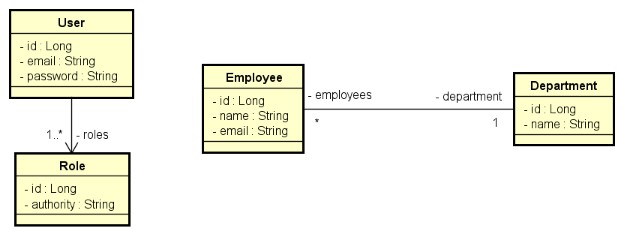

# DESAFIO Empregados Auth 
#### Java Spring Expert

Você deverá implementar as funcionalidades para que os testes passem. 

Este é um sistema de funcionários e departamentos com uma relação N-1 entre eles: 

Implemente as funcionalidades necessárias para que os testes do projeto abaixo passem (veja vídeo explicativo). 

Este é um sistema de funcionários e departamentos com uma relação N-1 entre eles: 

### Regras de controle de acesso:
- **Todas** as rotas são protegidas. 
- Usuários **ADMIN** podem ler e alterar recursos, enquanto que usuários **OPERATOR** podem apenas ler. 

### Regras de validações de Employee:
- Nome não pode ser vazio 
- Email deve ser válido 
- Departamento não pode ser nulo 

### Passos para resolver o desafio:
- Modelo de dados User-Role
  - Entidades
  - Seed da base de dados
- Incluir infraestrutura de exceções e validação
  - Dependências Bean Validation
  - Exceções de serviço customizadas
  - Handler de exceções dos controladores
- Incluir infraestrutura de segurança ao projeto
  - Dependências Spring Security e OAuth2
  - Variáveis de ambiente
  - Checklist do Spring Security
  - Implementação customizada password grant
  - Classes de configuração Authorization Server e Resource Server
  - Implementar as funcionalidades

