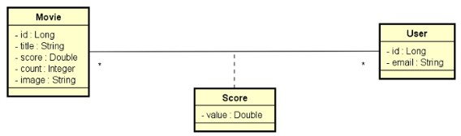

# DESAFIO: Validação e Segurança

##### Java Spring Expert

### Desafio

Implemente as funcionalidades necessárias para que os testes do projeto abaixo passem. 

Este é um sistema de eventos e cidades com uma relação N-1 entre eles: 

### Regras de controle de acesso

- Somente rotas de leitura (GET) de eventos e cidades são públicas (não requer login). 
- Usuários CLIENT e/ou ADMIN podem inserir novos eventos (POST). 
- Os demais acessos são permitidos apenas a usuários ADMIN. 

### Regras de validação de _City_

- Nome não pode ser vazio 

### Regras de validação de _Event_

- Nome não pode ser vazio 
- Data não pode ser passada 
- Cidade não pode ser nula 

### Critérios de avalição

- POST /events deve retornar 401 Unauthorized para usuário não logado 
- POST /events deve retornar 201 Created para CLIENT logado e dados corretos 
- POST /events deve retornar 201 Created para ADMIN logado e dados corretos 
- POST /events deve retornar 422 Unproccessable Entity para ADMIN logado e nome em branco 
- POST /events deve retornar 422 Unproccessable Entity para ADMIN logado e data no passado 
- POST /events deve retornar 422 Unproccessable Entity para ADMIN logado e cidade nula 
- GET /events deve retornar 200 Ok com página de recursos 
- POST /cities deve retornar 401 Unauthorized para usuário não logado 
- POST /cities deve retornar 403 Forbidden para CLIENT logado 
- POST /cities deve retornar 201 Created para ADMIN logado e dados corretos 
- POST /cities deve retornar 422 Unprocessable Entity para ADMIN logado e nome em branco 
- GET /cities deve retornar 200 Ok com todos recursos ordenados por nome 

### Competências avaliadas

- Desenvolvimento TDD de API Rest com Java e Spring Boot 
- Implementação de segurança com Spring Security e OAuth2 
- Controle de acesso por rotas e perfis de usuário 
- Validação de dados com Bean Validation 