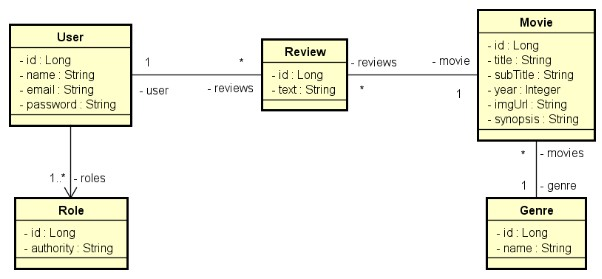

# DESAFIO: MovieFlix

##### Java Spring Expert

### Desafio

Implemente as funcionalidades necessárias para que os testes do projeto abaixo passem. 

### Casos de uso

##### Listar filmes
1. [OUT] O **sistema** apresenta uma listagem dos nomes de todos gêneros, bem como uma listagem paginada com título, subtítulo, ano e imagem dos filmes, **ordenada alfabeticamente por título**. 
2. [IN] O **usuário visitante ou membro** seleciona, opcionalmente, um gênero. 
3. [OUT] O **sistema** apresenta a listagem atualizada, restringindo somente ao gênero selecionado. 

#### Visualizar detalhes do filme
1. [IN] O usuário visitante ou membro seleciona um filme 
2. [OUT] O sistema informa título, subtítulo, ano, imagem e sinopse do filme, e também uma listagem dos textos das avaliações daquele filme juntamente com nome do usuário que fez cada avaliação. 
3. [IN] O usuário membro informa, opcionalmente, um texto para avaliação do filme. 
4. [OUT] O sistema apresenta os dados atualizados, já aparecendo também a avaliação feita pelo usuário. 

   **Exceção 3.1 - Texto vazio** 
        3.1.1. O sistema apresenta uma mensagem de que não é permitido texto vazio na avaliação 

### Critérios de avalição

- GET /genres deve retornar 401 para token inválido 
- GET /genres deve retonar 200 com todos gêneros para VISITOR logado 
- GET /genres deve retonar 200 com todos gêneros para MEMBER logado 
- GET /movies/{id} deve retornar 401 para token inválido 
- GET /movies/{id} deve retornar 200 com o filme para VISITOR logado 
- GET /movies/{id} deve retornar 200 com o filme para MEMBER logado 
- GET /movies/{id} deve retornar 404 para id inexistente 
- GET /movies deve retornar 401 para token inválido 
- GET /movies deve retornar 200 com página ordenada de filmes para VISITOR logado 
- GET /movies deve retornar 200 com página ordenada de filmes para MEMBER logado 
- GET /movies?genreId={id} deve retornar 200 com página ordenada de filmes filtrados por gênero 
- POST /reviews deve retornar 401 para token inválido 
- POST /reviews deve retornar 403 para VISITOR logado 
- POST /reviews deve retornar 201 com objeto inserido para MEMBER logado e dados válidos 
- POST /reviews deve retornar 422 para MEMBER logado e dados inválidos 

### Competências avaliadas

- Desenvolvimento TDD de API Rest com Java e Spring Boot 
- Realização de casos de uso 
- Consultas a banco de dados relacional com Spring Data JPA 
- Tratamento de erros com respostas HTTP customizadas 
- Controle de acesso por perfil de usuário e rotas 
