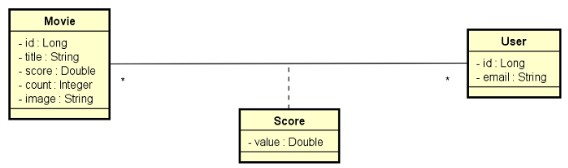

# DESAFIO: DSMovie Jacoco 

##### Java Spring Expert

### Desafio

Você deve implementar todos os testes unitários de service para o projeto DSMovie.

### Sobre o projeto DSMovie

 Este é um projeto de filmes e avaliações de filmes. A visualização dos dados dos filmes é pública (não necessita login), porém as alterações de filmes (inserir, atualizar, deletar) são permitidas apenas para usuários ADMIN. As avaliações de filmes podem ser registradas por qualquer usuário logado CLIENT ou ADMIN. A entidade Score armazena uma nota de 0 a 5 (score) que cada usuário deu a cada filme. Sempre que um usuário registra uma nota, o sistema calcula a média das notas de todos usuários, e armazena essa nota média (score) na entidade Movie, juntamente com a contagem de votos (count). 

Abaixo estão os testes unitários que você deverá implementar. Com todos os testes, o Jacoco deve reportar 100% de cobertura, mas o mínimo para aprovação no desafio são 12 dos 15 testes. 

#### MovieServiceTests:
- findAllShouldReturnPagedMovieDTO 
- findByIdShouldReturnMovieDTOWhenIdExists 
- findByIdShouldThrowResourceNotFoundExceptionWhenIdDoesNotExist 
- insertShouldReturnMovieDTO 
- updateShouldReturnMovieDTOWhenIdExists 
- updateShouldThrowResourceNotFoundExceptionWhenIdDoesNotExist 
- deleteShouldDoNothingWhenIdExists 
- deleteShouldThrowResourceNotFoundExceptionWhenIdDoesNotExist 
- deleteShouldThrowDatabaseExceptionWhenDependentId 
#### ScoreServiceTests:
- saveScoreShouldReturnMovieDTO 
- saveScoreShouldThrowResourceNotFoundExceptionWhenNonExistingMovieId 
#### UserServiceTests:
- authenticatedShouldReturnUserEntityWhenUserExists 
- authenticatedShouldThrowUsernameNotFoundExceptionWhenUserDoesNotExists 
- loadUserByUsernameShouldReturnUserDetailsWhenUserExists 
- loadUserByUsernameShouldThrowUsernameNotFoundExceptionWhenUserDoesNotExists 
 

### Critérios de avalição

Critérios de correção:
Mínimo para aprovação: 12 de 15

- MovieService.findAll() deve retornar uma página de filmes 
- MovieService.findById(id) deve retornar um filme quando o id existir 
- MovieService.findById(id) deve lançar ResourceNotFoundException quando o id não existir 
- MovieService.insert(dto) deve retornar um filme 
- MovieService.update(id, dto) deve retornar um filme quando o id existir 
- MovieService.update(id, dto) deve lançar ResourceNotFoundException quando o id não existir 
- MovieService.delete(id) deve fazer nada quando o id existir 
- MovieService.delete(id) deve lançar ResourceNotFoundException quando o id não existir 
- MovieService.delete(id) deve lançar DatabaseException quando o id for dependente 
- UserService.authenticated() deve retornar um usuário quando houver usuário logado 
- UserService.authenticated() deve lançar UsernameNotFoundException quando não houver usuário logado 
- UserService.loadUserByUsername(username) deve retornar um UserDetails quando o username existir 
- UserService.loadUserByUsername(username) deve lançar UsernameNotFoundException quando o username não existir 
- ScoreService.saveScore(dto) deve retornar os dados do filme quando o id existir 
- ScoreService.saveScore(dto) deve lançar ResourceNotFoundException quando o id do filme não existir 

### Competências avaliadas

- Testes unitários em projeto Spring Boot com Java 
- Implementação de testes unitários com JUnit e Mockito 
- Cobertura de código com Jacoco 
