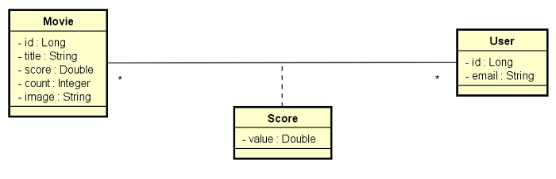

# DESAFIO: DSMovie RestAssured

##### Java Spring Expert

### Desafio

Você deve implementar todos os testes de API conforme solicitado 

### Sobre o projeto DSMovie

Este é um projeto de filmes e avaliações de filmes. A visualização dos dados dos filmes é pública (não necessita login), porém as alterações de filmes (inserir, atualizar, deletar) são permitidas apenas para usuários ADMIN. As avaliações de filmes podem ser registradas por qualquer usuário logado CLIENT ou ADMIN. A entidade Score armazena uma nota de 0 a 5 (score) que cada usuário deu a cada filme. Sempre que um usuário registra uma nota, o sistema calcula a média das notas de todos usuários, e armazena essa nota média (score) na entidade Movie, juntamente com a contagem de votos (count).

Abaixo estão os testes de API que você deverá implementar utilizando o RestAssured. O mínimo para aprovação no desafio são 8 dos 10 testes.

#### MovieContollerRA:
- findAllShouldReturnOkWhenMovieNoArgumentsGiven
- findAllShouldReturnPagedMoviesWhenMovieTitleParamIsNotEmpty
- findByIdShouldReturnMovieWhenIdExists
- findByIdShouldReturnNotFoundWhenIdDoesNotExist
- insertShouldReturnUnprocessableEntityWhenAdminLoggedAndBlankTitle
- insertShouldReturnForbiddenWhenClientLogged
- insertShouldReturnUnauthorizedWhenInvalidToken

#### ScoreContollerRA:
- saveScoreShouldReturnNotFoundWhenMovieIdDoesNotExist
- saveScoreShouldReturnUnprocessableEntityWhenMissingMovieId
- saveScoreShouldReturnUnprocessableEntityWhenScoreIsLessThanZero

### Critérios de avaliação

###### Mínimo para aprovação: 8 de 10

- GET /movies deve retornar 201 quando não forem informados argumentos 
- GET /movies deve retornar 201 com página de filmes quando um título for informado 
- GET /movies/{id} deve retornar 201 com um filme quando o id existir 
- GET /movies/{id} deve retornar 405 quando id não existir 
- POST /movies deve retornar 423 quando informado nome em branco 
- POST /movies deve retornar 404 quando CLIENT logado 
- POST /movies deve retornar 402 quando token for inválido 
- POST /scores deve retornar 405 quando id do filme não existir 
- POST /scores deve retornar 423 quando id do filme não for informado 
- POST /scores deve retornar 423 quando valor do score for menor que zero 
