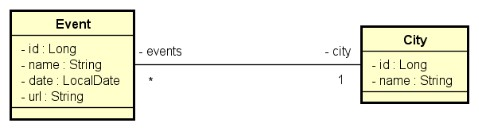

# DESAFIO: TDD Event City
##### Java Spring Expert

### Desafio
Implemente as funcionalidades necessárias para que os testes do projeto abaixo passem. 

Este é um sistema de eventos e cidades com uma relação N-1 entre eles: 

### Critérios de avalição

- DELELE /cities/{id} deve retornar 404 Not Found quando id não existir 
- DELELE /cities/{id} deve retornar 204 No Content quando id for independente 
- DELETE /cities/{id} deve retornar 400 Bad Request quando id for dependente 
- POST /cities deve inserir recurso 
- GET /cities deve retornar recursos ordenados por nome 
- PUT /events deve atualizar recurso quando id existir 
- PUT /events deve retornar 404 Not Found quando id não existir 

### Competências avaliadas

- Desenvolvimento TDD de API Rest com Java e Spring Boot 
- Implementação de cenários de busca, inserção, deleção e atualização 
- Tratamento de exceções em API com respostas HTTP customizadas 
